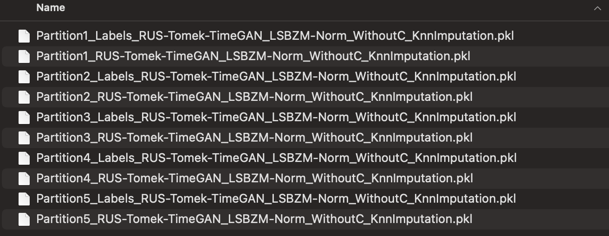

# Preprocessed-SWANSF

## Introduction
The **SWAN-SF dataset** is now fully preprocessed, optimized, and ready for binary classification tasks. Our team is excited to release the enhanced version of the SWAN-SF dataset across all five partitions. This version benefits from our **Similarity-based KNN Imputation** technique, the **elimination of Class C samples** to address class overlap issues, and the implementation of **TimeGAN**, **Tomek Links**, and **Random Under Sampling** as over- and under-sampling strategies. With **LSBZM normalization** applied, our optimized dataset empowers researchers to develop more precise classifiers by focusing on analysis rather than preprocessing steps, aiming to improve the TSS score significantly.

## Original Dataset
The unpreprocessed version of the SWAN-SF dataset can be accessed on the Harvard Dataverse:
- [SWAN-SF Dataset on Harvard Dataverse](https://dataverse.harvard.edu/dataset.xhtml?persistentId=doi:10.7910/DVN/EBCFKM)

For more detailed information about the SWAN-SF dataset, please refer to the following paper:
- [Flare Prediction from Multivariate Time Series Data of Photospheric Magnetic Field Parameters](https://www.nature.com/articles/s41597-020-0548-x)

## How to Use
To access our fully preprocessed version of the dataset, open the `Preprocessed_SWANSF.txt` file, where you will find a Google Drive link to the dataset. The zip file includes 10 files: one data file and one label file for each of the five partitions.

Each partition includes both data and labels, catering to comprehensive binary classification tasks.
<br/>
<br/>


### Setup
Ensure you have `pickle` and `numpy` packages installed in your environment. Use the Python code below to load the data into a numpy array:

```python
import pickle
import numpy as np

data_dir = "/path/to/your/Preprocessed_SWANSF/"
X_train = []
y_train = []
num_partitions = 5

for i in range(num_partitions):
    with open(f"{data_dir}Partition{i+1}_RUS-Tomek-TimeGAN_LSBZM-Norm_WithoutC_KnnImputation.pkl", 'rb') as f:
        X_train.append(pickle.load(f))
    with open(f"{data_dir}Partition{i+1}_Labels_RUS-Tomek-TimeGAN_LSBZM-Norm_WithoutC_KnnImputation.pkl", 'rb') as f:
        y_train.append(pickle.load(f))
```

### Data Structure
Each partition is stored in a 2D `.pkl` file, with the shape `(num_samples, num_attributes)`. The attributes are concatenated across 24 time series attributes with 60 timestamps each, resulting in a 1440-dimensional vector per sample.

### Attributes Order
The order of the attributes in the array is as follows:
`['R_VALUE', 'TOTUSJH', 'TOTBSQ', 'TOTPOT', 'TOTUSJZ', 'ABSNJZH', 'SAVNCPP', 'USFLUX', 'TOTFZ', 'MEANPOT', 'EPSX', 'EPSY', 'EPSZ', 'MEANSHR', 'SHRGT45', 'MEANGAM', 'MEANGBT', 'MEANGBZ', 'MEANGBH', 'MEANJZH', 'TOTFY', 'MEANJZD', 'MEANALP', 'TOTFX']`

### Data Interpretation Examples
- `X_train[0][0,0:60]` corresponds to the `R_VALUE` attribute of the first sample of partition 1. This slice gives you the time series data for the `R_VALUE` attribute for the first sample.
- `X_train[3][20,60:120]` corresponds to the `TOTUSJH` attribute of the twenty-first sample of partition 4. Here, you're accessing the time series data for the `TOTUSJH` attribute for a specific sample in partition 4.

The `y_train` files hold the labels for the samples, organized in a 1D vector:
- `y_train[0][0]` corresponds to the label of the first Multivariate Time Series (MVTS) sample of partition 1, which can be 0 or 1, indicating the binary classification target.

### Citation
Our paper detailing this preprocessed dataset is currently under review. Please ensure to cite it appropriately once published.
